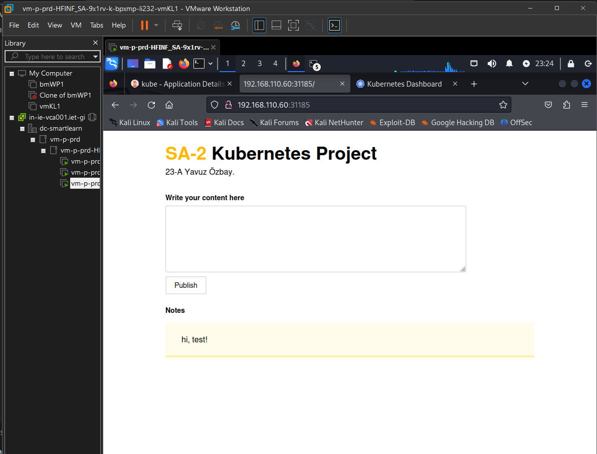
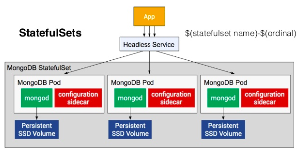
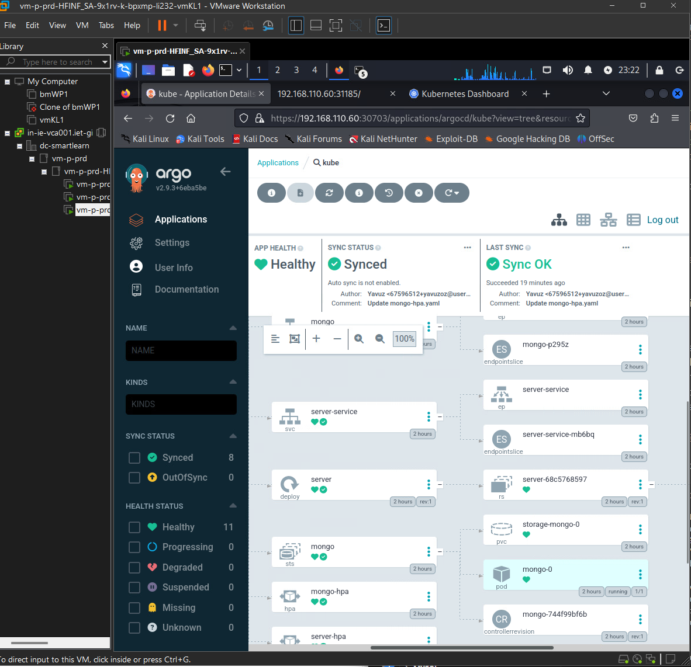
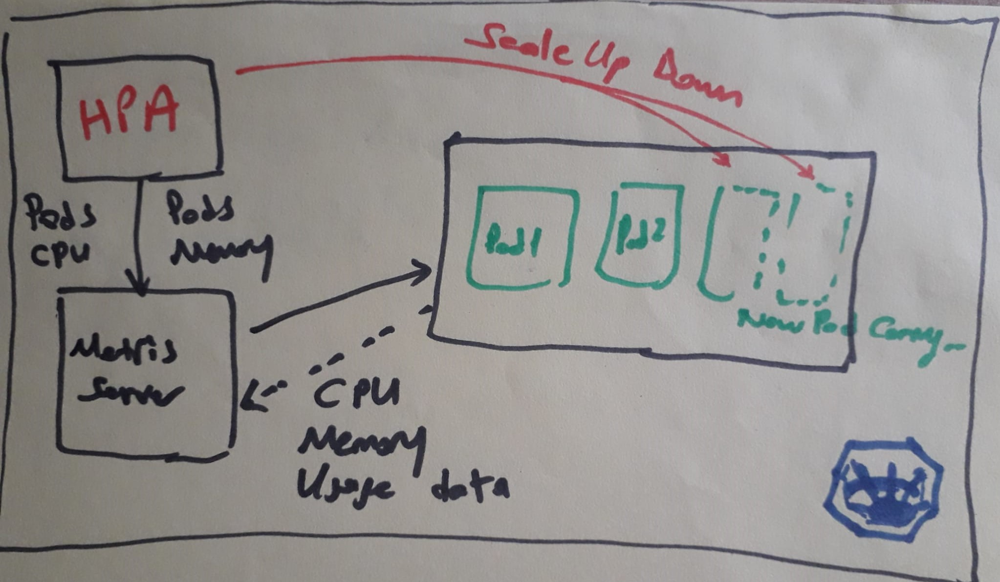
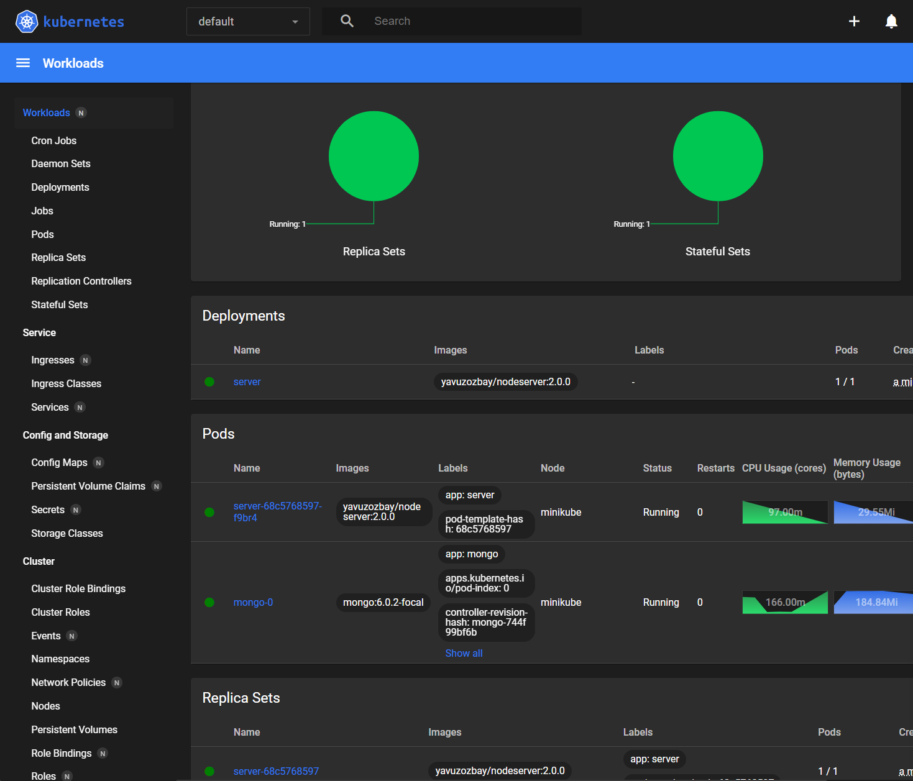
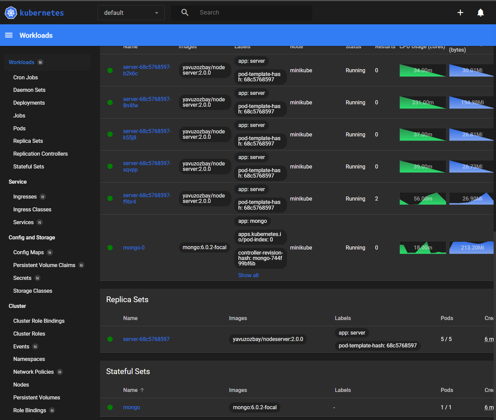
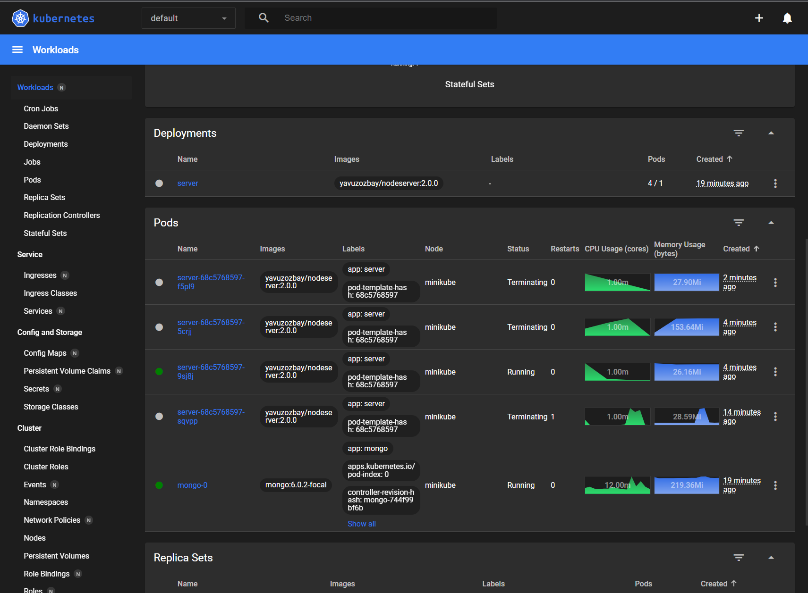

# SA II Project: Building and Scaling expressjs-mongodb-app on Kubernetes
## Project Overview
Welcome to the documentation of the System Administration II course at TSBE. This project focuses on the installation and scaling of the expressjs-mongodb-app on a Kubernetes cluster.
## Project Goals
The primary objectives of this project are to set up and configure a Kubernetes cluster with the following key features:

- **Scalability:** to setup Horizontal and Vertical Pod Autoscaling in kubernetes.
- **Persistent Storage:** Implementing containers with persistent storage, specifically for a MongoDB Database.
- **Container Networking:** Establishing effective container networking with port forwarding to enable external access.
- **Security:** Configuring a secure environment to minimize potential security risks.

---------------------------------------------------------------------------------------

#### Project Display

This application is a note-taking system developed using Express.js and MongoDB. It enables users to create and share textual notes through a web interface and has been Dockerized and the Docker image is available on [Docker Hub](https://hub.docker.com/repository/docker/yavuzozbay/nodeserver). 

```bash
docker pull yavuzozbay/nodeserver:2.0.0
```
#### Browser Request Flow through the K8s components


MongoDB with StatefulSets on this Project




## Platform & Limitations
The following virtual platform is hosted by the school to execute the project:

<h5>vmKL1</h5>
The vmKL1 is the management machine used to set up, administer, and access the Kubernetes cluster.

**VM Specs:**
- OS: Kali GNU/Linux
- Kernel: Linux 6.5.0-kali3-amd64
- CPU: 2 vCPUs
- RAM: 16 GB
- Storage: /dev/sda 35 GB
- Network: Access to vmLM1 & Internet
- IP: 192.168.110.70

**Installed Software:**
- vscode 

<h5>vmLM1</h5>
The vmLM1 is the Kubernetes host itself. It will act as Control Plane (Master Node) & Data Plane (Worker Node).

**VM Specs:**
- OS: Ubuntu 22.04.3 LTS
- Kernel: Linux
- CPU: 4 vCPUs
- RAM: 12 GB
- Storage: /dev/sda 16 GB
- Network: Access to vmKL1 & Internet
- IP: 192.168.110.60

**Installed Software:**
- minikube version: v1.32.0
- Docker version 24.0.5

The container network is set up in a way that only necessary communication is allowed. UFW is active and configured. Open ports to the Kubernetes Node (vmLM1):

- 22/TCP -> SSH
- 443/TCP -> Kubernetes API
- 30703/TCP -> express-mongodb-app
- 8001/TCP -> Kubernetes Dashboard
- 31185/TCP -> Argocd (optional)

As far as the container network goes, only pods that need external access are configured with NodePort. All other pods are configured with Cluster IP for Kubernetes internal-only communication.

<h5>Manual Setup Guide</h5>
<h5>vmKL1</h5>

```bash
# Update the System
sudo apt update -y
sudo apt upgrade -y
```
<h5>vmLM1</h5>

```bash
# Port forward , Enable & open necessary ports on the server firewall
sudo ufw allow 22/tcp
sudo ufw allow 443/tcp
sudo ufw allow 80
sudo ufw allow 8001 # for minikube dashboard
sudo ufw allow 30703 # for express-mongodb-app
sudo ufw allow 31185 # for ArgoCD (optional)
sudo ufw enable
```
<h5>Enable SSH Access</h5>
Port 22

```bash
# Restart sshd
sudo systemctl restart sshd
```
```bash
# Update the System
sudo apt update -y
sudo apt upgrade -y
```
```bash
# Install Docker
sudo apt install docker.io
docker --version # Check Docker version
```
```bash
# Download Minikube
curl -LO https://storage.googleapis.com/minikube/releases/latest/minikube-linux-amd64
sudo install minikube-linux-amd64 /usr/local/bin/minikube
minikube version # Check Minikube version
```
```bash
# Install Kubectl
sudo snap install kubectl --classic
kubectl version # Check Kubectl version
```
```bash
# Start Minikube with Docker driver
minikube start --driver=docker
sudo usermod -aG docker $USER && newgrp docker
minikube node add —worker
kubectl label node <node_name> node-role.kubernetes.io/worker=worker
kubectl get nodes
```
```bash
# Update local apt cache
sudo apt update
```
```bash
# Create a namespace for the app
kubectl create namespace expressjs-mongodb-app
```
```bash
# Create a project folder for deployment
mkdir ~/kube
cd kube
```
```bash
# create project yaml files
sudo nano mongo-config.yaml
sudo nano mongo.yaml
sudo nano mongo-hpa.yaml
sudo nano server.yaml
sudo nano server-hpa.yaml
```
```bash
# apply project yaml files
kubectl apply -f  mongo-config.yaml
kubectl apply -f  mongo.yaml
kubectl apply -f  mongo-hpa.yaml
kubectl apply -f  server.yaml
kubectl apply -f  server-hpa.yaml
```
##### Easy to Apply, you can automaticly with ArgoCD tool all yaml files to apply (optional)

```bash
# create argocd
kubectl create namespace argocd
kubectl apply -n argocd -f https://raw.githubusercontent.com/argoproj/argo-cd/stable/manifests/install.yaml
```
- Argocd server LoadBalancer to etxternal service
```bash
kubectl patch svc argocd-server -n argocd -p '{"spec": {"type": "LoadBalancer"}}'

```

- Argocd server NodePort to etxernal service
```bash
kubectl patch svc argocd-server -n argocd -p '{"spec": {"type": "NodePort"}}'

```

- ArgoCD password to take( username : admin)
```bash
kubectl -n argocd get secret argocd-initial-admin-secret -o jsonpath="{.data.password}" | base64 -d

```
- ArgoCD  services list

```bash
kubectl get services -n argocd
```
output:
 argocd-server                             LoadBalancer   10.105.157.43    <pending>     80:32033/TCP,443:32743/TCP 

- ArgoCD server Port forwarding

```bash
sudo socat TCP-LISTEN:31185,fork TCP:192.168.49.2:32743
```


### Programm on the Browser to open

```bash
kubectl get service

kubectl get pods
```

output service:
NAME             TYPE        CLUSTER-IP      EXTERNAL-IP   PORT(S)        AGE
kubernetes       ClusterIP   10.96.0.1       <none>        443/TCP        18m
mongo            ClusterIP   10.103.129.64   <none>        27017/TCP      34s
server-service   NodePort    10.99.192.106   <none>        80:30285/TCP   34s

output pods: 
NAME                      READY   STATUS    RESTARTS   AGE                                                                                       
mongo-0                   1/1     Running   0          110m                                                                                      
server-68c5768597-xspgk   1/1     Running   0          110m  

```bash
# Start server service
minikube service server-service
minikube service server-service --url

# server-service port forwarding
sudo socat TCP-LISTEN:30703,fork TCP:192.168.49.2:30285
```

```bash
# Start dashboard
minikube dashboard
minikube dashboard --url=true
kubectl proxy --address='0.0.0.0' --disable-filter=true
```

To send some load(http request) to the application i used hey tool 

```bash
# for Testing HPA
sudo apt install hey
```

## Setup Horizontal Pod Autoscaling in kubernetes:

Autoscaling is one of the great features of kubernetes allowing us to automatically horizontally scale nodes or pods depending on the demand or load on our web application, it even allows us to do vertical autoscaling in case of pods.



### Horizontal Pod Autoscaler(HPA)?

I define my deployment in server.yaml set the number of number replicas like:
```bash
apiVersion: apps/v1
kind: Deployment
metadata:
  name: server
spec:
  replicas: 1
  selector:
    matchLabels:
      app: server
  template:
    metadata:
      labels:
        app: server
    spec: 
      containers:
        - name: server
          image: yavuzozbay/nodeserver:2.0.0
          ports:
            - containerPort: 3000
          env:
            - name: MONGO_URL
              valueFrom:
                configMapKeyRef:
                  name: mongo-config
                  key: MONGO_URL
          imagePullPolicy: Always
          resources:
            requests:
              memory: "128Mi"
              cpu: "100m"
            limits:
              memory: "264Mi"
              cpu: "250m"
```
With the HPA resource defined we can tune up the number of replicas up and down depending on CPU usage or memory usage.

```bash
apiVersion: autoscaling/v1
kind: HorizontalPodAutoscaler
metadata:
  name: server-hpa
spec:
  scaleTargetRef:
    apiVersion: apps/v1
    kind: Deployment
    name: server
  minReplicas: 1
  maxReplicas: 10
  targetCPUUtilizationPercentage: 50
``` 
The main components of the file definition for hpa are:

- scaleTargetRef.name- which points to our deployment name.
- minReplicas - minimum number of replicas running at all time.
- maxReplicas - maximum number of replicas that HPA can scale up to. It sets the upper limit and pods cannot be scaled up more than maxReplicas number.
- targetCPUUtilizationPercentage - this is the threshold of CPU resource usage on the pod. When the threshold is hit the HPA adds a new pod. We have set it scale if CPU usage crosses 50%.
- targetCPUUtilizationPercentage- this is a similar threshold but for memory utilization.

How HPA works?
For hpa to work it needs to have access to metrics like CPU and memory usage of our kubernetes pod component. The metrics are supplied through metrics server which pulls the usage out of the pods. HPA can then query metrics server with the latest usage information about CPU and memory and then scale up according to the values set in our server-hpa.yaml.

Installing metrics-server
First we need to install metrics server that will query the pod for CPU and Memory usage. On minikube it can be done by :
minikube addons enable metrics-server

or for other clusters it can be installed with a kubectl deployment command.

This installs a metrics-server inside the kube-system namespace and can be checked via:

```bash
kubectl get pods -n kube-system | grep metrics-server
Output:
metrics-server-d9b576748-rr6vb              1/1     Running     2          4h5m
```
#### Setting up HPA
Lets quickly install hpa by just running:
kubectl apply -f server-hpa.yaml

This will setup the HPA resource to track server app deployment and to check if its setup just run:
```bash
kubectl get hpa server-hpa
NAME         REFERENCE           TARGETS   MINPODS   MAXPODS   REPLICAS   AGE
server-hpa   Deployment/server   1%/50%    1         10        1          49m

```
#### Testing HPA

To test if HPA actually scales the pods, lets try to put some load on our application. In the deployment  server.yaml i have also setup some default resource limits on our pods like :

```bash
        resources:
            requests:
              memory: "128Mi"
              cpu: "100m"
            limits:
              memory: "264Mi"
              cpu: "250m"
```
I have added a /compute to the demo nodejs application with some non-blocking nodejs code so that we can call the endpoint multiple times and it ends up simulating a more realistic load situation by doing a heavy calculation.

Test Result : 
After we are able to sustain the load for some time the HPA comes into action and increases the pod replica count to our specified number until the load gets back to normal and then brings it down to minimum number.

initial state



With HTTP Requests
Simulating load on the deployment pods
```bash
hey -c 2 -n 1 -z 5m http://192.168.49.2:30285/compute
```



Once the CPU load flattens down to normal the extra new pods are removed.



Happy Coding! 🚀

"Legends never die, they just update !" 

Happy coding, and may your Kubernetes journey be smooth and successful!

